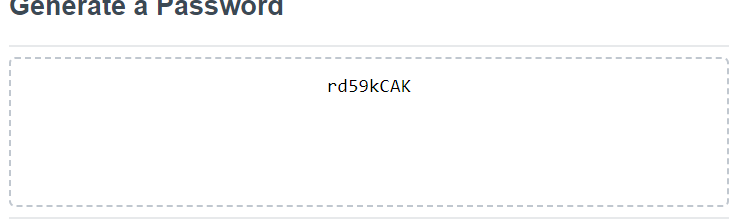

# Password Generator 
* For this challenge we had to create a website that would make a random password based on the users input 
- To do this I had to utilize javascript alerts to get the users input 

- Then using let and if statements the program would formulate a randomized password 

